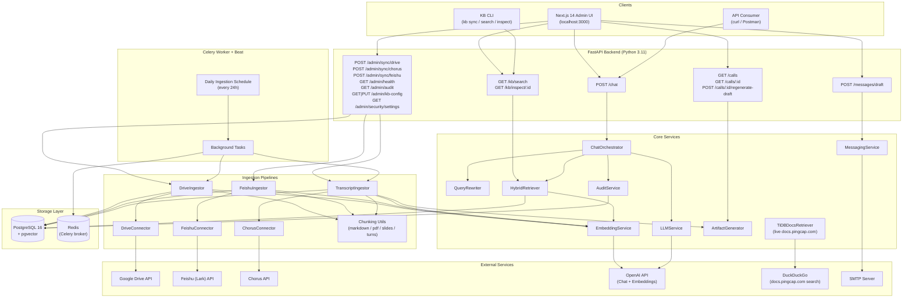
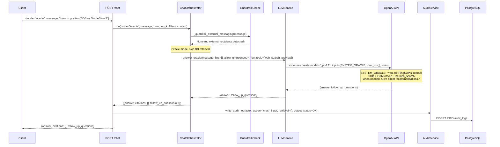
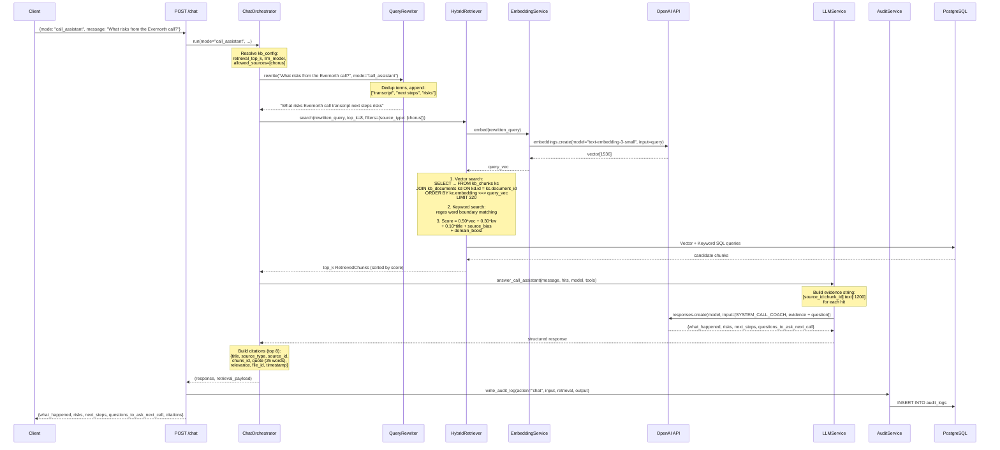
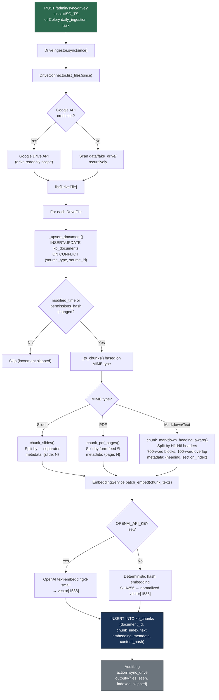
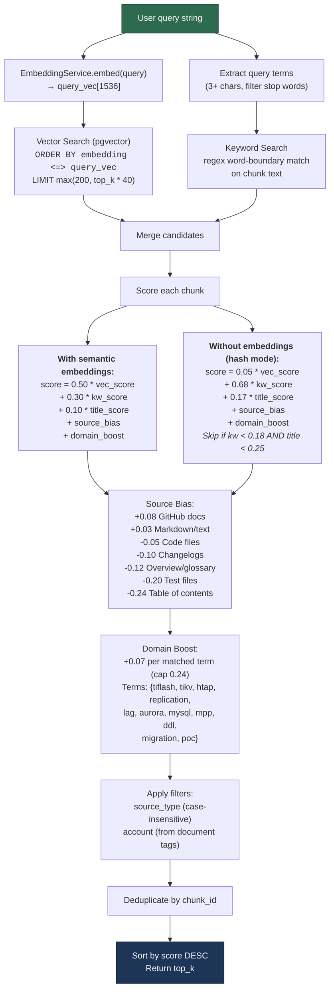
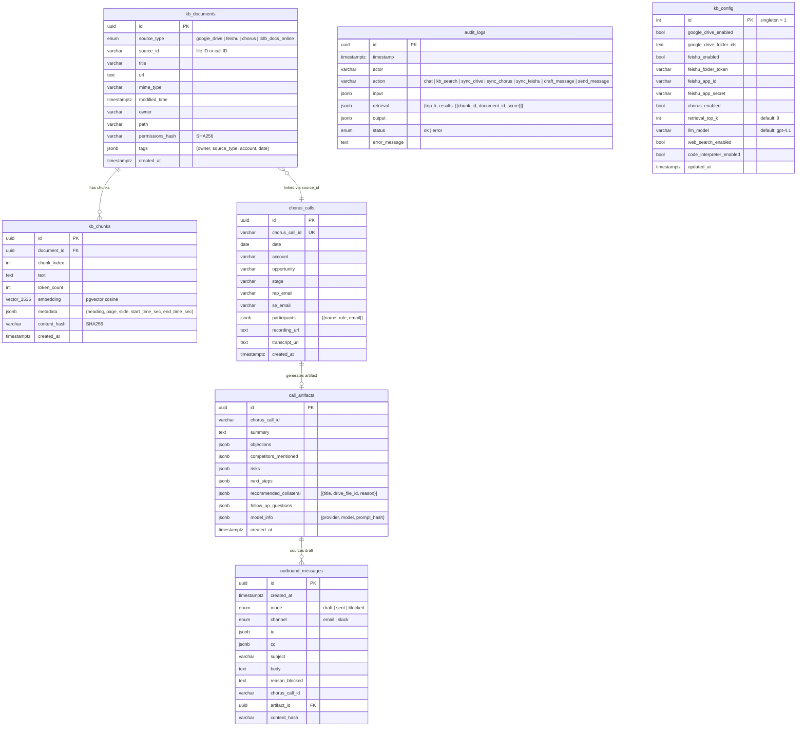

# tidb-oracle

Internal-only TiDB + PingCAP GTM copilot grounded in Google Drive, Feishu, and Chorus transcripts.

## Architecture Overview



## RAG Query Flow

### Oracle Mode (Ungrounded LLM Chat)



### Call Assistant Mode (Grounded RAG)



## Ingestion Pipelines

### Google Drive Ingestion



### Chorus Transcript Ingestion

```mermaid
flowchart TB
    TRIGGER["POST /admin/sync/chorus?since=YYYY-MM-DD<br/>or Celery daily_ingestion task"]

    TRIGGER --> TI["TranscriptIngestor.sync(since)"]
    TI --> CC["ChorusConnector.fetch_calls(since)"]

    CC --> CREDS{CHORUS_API_KEY<br/>set?}
    CREDS -->|Yes| CAPI["Chorus /calls endpoint<br/>(Bearer token auth)"]
    CREDS -->|No| FAKE["Load data/fake_chorus/*.json"]

    CAPI --> CALLS["list[ChorusCallRaw]"]
    FAKE --> CALLS

    CALLS --> LOOP["For each raw call"]

    LOOP --> NORM["_normalize(payload)<br/>Standardize speaker_map, turns, metadata"]

    NORM --> UPSERT_CALL["_upsert_call()<br/>INSERT/UPDATE chorus_calls<br/>(chorus_call_id, date, account,<br/>opportunity, stage, rep_email,<br/>se_email, participants)"]

    UPSERT_CALL --> UPSERT_DOC["_upsert_document()<br/>INSERT/UPDATE kb_documents<br/>source_type=chorus"]

    UPSERT_DOC --> CHUNK["_replace_chunks()<br/>chunk_transcript_turns()"]

    CHUNK --> CHUNK_DETAIL["Accumulate turns into chunks:<br/>45-90 second windows or 700 tokens<br/>Include speaker name + role + HH:MM:SS<br/>metadata: {start_time_sec, end_time_sec}"]

    CHUNK_DETAIL --> EMBED["EmbeddingService.batch_embed(chunk_texts)"]
    EMBED --> STORE_CHUNKS["DELETE old chunks for document<br/>INSERT new kb_chunks with embeddings"]

    STORE_CHUNKS --> GEN_ART["_replace_artifact()<br/>ArtifactGenerator.generate()"]

    GEN_ART --> HEURISTIC["Heuristic extraction:<br/>- Competitors: {singlestore, cockroachdb,<br/>  snowflake, spanner}<br/>- Objections: {lag, ddl/schema, cost}<br/>- Risks: standard set + LLM-generated<br/>- Next steps: standard set + LLM-generated<br/>- Recommended collateral links"]

    HEURISTIC --> STORE_ART["INSERT/UPDATE call_artifacts<br/>(summary, objections, competitors_mentioned,<br/>risks, next_steps, recommended_collateral,<br/>follow_up_questions, model_info)"]

    STORE_ART --> AUDIT["AuditLog<br/>action=sync_chorus<br/>output={calls_seen, processed}"]

    style TRIGGER fill:#2d6a4f,stroke:#1b4332,color:#fff
    style STORE_CHUNKS fill:#1d3557,stroke:#0d1b2a,color:#fff
    style STORE_ART fill:#1d3557,stroke:#0d1b2a,color:#fff
    style AUDIT fill:#6c757d,stroke:#495057,color:#fff
```



### Feishu (Lark) Ingestion


## Hybrid Retrieval Scoring



## Database Schema



## Messaging Guard Rails

```mermaid
flowchart TB
    REQ["POST /messages/draft<br/>{to, cc, mode, tone, chorus_call_id}"]

    REQ --> VALIDATE["MessagingService.validate_recipients(to, cc)"]

    VALIDATE --> CHECK{All recipients match<br/>INTERNAL_DOMAIN_ALLOWLIST?<br/>(default: pingcap.com)}

    CHECK -->|No| BLOCKED["mode = BLOCKED<br/>reason_blocked = 'Outbound messages<br/>restricted to internal recipients'"]

    CHECK -->|Yes| BUILD["Build email:<br/>subject: '{account} call takeaways + next-step questions'<br/>body: summary + next_steps + questions + collateral"]

    BUILD --> MODE{EMAIL_MODE setting<br/>AND requested mode?}

    MODE -->|"EMAIL_MODE=draft<br/>(always)"| DRAFT["mode = DRAFT<br/>Store in outbound_messages"]
    MODE -->|"EMAIL_MODE=send<br/>AND mode=send"| SEND["Send via SMTP (STARTTLS)<br/>mode = SENT"]

    BLOCKED --> AUDIT["AuditLog"]
    DRAFT --> AUDIT
    SEND --> AUDIT

    style BLOCKED fill:#c0392b,stroke:#922b21,color:#fff
    style DRAFT fill:#f39c12,stroke:#d68910,color:#fff
    style SEND fill:#27ae60,stroke:#1e8449,color:#fff
```

## What this repository provides

- FastAPI backend for RAG chat (`oracle`, `call_assistant`) with citations and follow-up questions
- Google Drive ingestion pipeline (Docs/PDF/Slides/Sheets-text) into Postgres + pgvector
- Feishu (Lark) document ingestion pipeline
- Chorus daily transcript ingestion pipeline with normalization, chunking, and artifact generation
- Internal-only messaging draft/send workflow with recipient allowlist enforcement
- Live TiDB docs search via DuckDuckGo (docs.pingcap.com)
- Audit logging of prompts, retrieval chunk ids/scores, outputs, timestamps, and mode
- Minimal Next.js admin UI for docs/transcripts/artifacts/draft regeneration
- Celery worker + beat for background and daily jobs
- Synthetic datasets and integration tests

## Security and policy constraints

- Internal outbound only: all recipients must match `INTERNAL_DOMAIN_ALLOWLIST` (default `pingcap.com`)
- No transcript training/fine-tuning path; only retrieval-time context is used
- Read-only data connectors (Drive + Chorus + Feishu)
- Audit log persisted for chat/sync/generation/messaging actions
- Grounding behavior: if retrieval is weak/empty, chat asks for missing context instead of hallucinating
- Optional PII redaction before LLM calls (emails, phone numbers, card numbers)
- Optional enterprise hardening: require private LLM endpoints, egress allowlist, fail-closed on missing keys

## Repository layout

```text
/api
  /app
    /api/routes         # FastAPI endpoints (chat, kb, calls, messaging, admin)
    /core               # settings, constants
    /db                 # SQLAlchemy base, session, init_db
    /ingest             # Drive + Feishu + Chorus connectors and ingestors
    /models             # ORM entities (kb_documents, kb_chunks, chorus_calls, etc.)
    /prompts            # system prompt templates
    /retrieval          # HybridRetriever (vector + keyword + metadata scoring)
                        # TiDBDocsRetriever (live docs.pingcap.com search)
    /schemas            # Pydantic request/response contracts
    /services           # ChatOrchestrator, LLMService, EmbeddingService,
                        # MessagingService, ArtifactGenerator, AuditService,
                        # QueryRewriter
    /utils              # chunking, redaction, hashing, email_utils
  /alembic              # DB migrations
/workers
  /jobs                 # Celery worker entry wrappers
/ui                     # Next.js 14 admin UI
/infra                  # docker-compose (postgres, redis, api, worker, beat, ui)
/tests
  /unit                 # guardrails, chunking, security controls
  /integration          # drive ingestion, chat + guardrails, messaging + audit
  /retrieval            # TiDB docs retrieval accuracy
/data
  /fake_drive           # synthetic Drive documents (+ optional GitHub repos)
  /fake_chorus          # synthetic Chorus call transcripts
/scripts
  generate_fake_drive_docs.py
  generate_gm_brief_slides.py
  seed_sqlite_mvp.py
  sync_github_sources.py
```

## Stack

| Layer | Technology |
|-------|-----------|
| Backend | Python 3.11 + FastAPI |
| Database | PostgreSQL 16 + pgvector (ivfflat, vector_cosine_ops) |
| Queue/Jobs | Celery + Redis |
| UI | Next.js 14 |
| LLM | OpenAI Chat API (default: gpt-4.1) |
| Embeddings | OpenAI text-embedding-3-small (1536 dims) |
| Fallback | Deterministic SHA256 hash embeddings + lexical synthesis |

## Key Functions Reference

### ChatOrchestrator (`services/chat_orchestrator.py`)

```python
class ChatOrchestrator:
    def run(*, mode: str, user: str, message: str,
            top_k: int, filters: dict, context: dict) -> tuple[dict, dict]
    # mode="oracle": LLM-direct (no DB), allow_ungrounded=True
    # mode="call_assistant": QueryRewriter → HybridRetriever → LLM with evidence
    # Returns (response_dict, retrieval_payload)
```

### HybridRetriever (`retrieval/service.py`)

```python
class HybridRetriever:
    def search(query: str, *, top_k: int = 8,
               filters: dict | None = None) -> list[RetrievedChunk]
    # 1. Vector: ORDER BY embedding <=> query_vec LIMIT max(200, top_k*40)
    # 2. Keyword: regex word-boundary match on chunk text
    # 3. Score: 0.50*vec + 0.30*kw + 0.10*title + source_bias + domain_boost
    # 4. Filter by source_type, account
    # 5. Dedup by chunk_id, sort by score DESC, return top_k
```

### EmbeddingService (`services/embedding.py`)

```python
class EmbeddingService:
    def embed(text: str) -> list[float]          # single text → vector[1536]
    def batch_embed(texts: Iterable[str]) -> list[list[float]]  # batch
    # With OPENAI_API_KEY: calls text-embedding-3-small
    # Without: SHA256 hash → deterministic normalized vector
```

### LLMService (`services/llm.py`)

```python
class LLMService:
    def answer_oracle(message: str, hits: list[RetrievedChunk], *,
                      model: str = None, tools: list = None,
                      allow_ungrounded: bool = False) -> dict
    # Returns {answer, follow_up_questions}
    # Fallback: _local_oracle_synthesis() (lexical ranking + heuristic response)

    def answer_call_assistant(message: str, hits: list[RetrievedChunk], *,
                              model: str = None, tools: list = None) -> dict
    # Returns {what_happened, risks, next_steps, questions_to_ask_next_call}
```

### DriveIngestor (`ingest/drive_ingestor.py`)

```python
class DriveIngestor:
    def sync(since: datetime | None = None) -> dict  # {files_seen, indexed, skipped}
    # Upsert documents, skip if unchanged, chunk by MIME, batch embed, store
```

### TranscriptIngestor (`ingest/transcript_ingestor.py`)

```python
class TranscriptIngestor:
    def sync(since: date | None = None) -> dict  # {calls_seen, processed}
    # Normalize → upsert call → upsert doc → chunk turns → embed → generate artifact
```

### Key SQL Queries

**Vector similarity search (pgvector)**:
```sql
SELECT kc.id, kc.text, kc.metadata, kc.embedding,
       kd.title, kd.source_type, kd.source_id, kd.url, kd.tags
FROM kb_chunks kc
JOIN kb_documents kd ON kd.id = kc.document_id
ORDER BY kc.embedding <=> :query_vec
LIMIT :candidate_limit
```

**ivfflat index**:
```sql
CREATE INDEX ix_kb_chunks_embedding
ON kb_chunks USING ivfflat (embedding vector_cosine_ops)
WITH (lists = 100);
```

## Quick start (Docker)

1. Create env file:

```bash
cp .env.example .env
```

2. Start stack:

```bash
cd infra
docker compose up --build
```

3. Run initial sync:

```bash
curl -X POST "http://localhost:8000/admin/sync/drive"
curl -X POST "http://localhost:8000/admin/sync/chorus"
```

4. Open:
- API docs: <http://localhost:8000/docs>
- UI: <http://localhost:3000>

## GitHub corpus sync (PingCAP repos/docs)

This project can index local text files under `data/fake_drive/**`.
Use the helper script to clone/pull GitHub repos into that folder, then run Drive sync.

```bash
export FAKE_DRIVE_INCLUDE_GITHUB=true

python3 scripts/sync_github_sources.py \
  --repo pingcap/tidb:master \
  --repo pingcap/docs:master

curl -X POST "http://localhost:8000/admin/sync/drive"
```

Notes:
- The connector recursively indexes supported text/code files (markdown, rst, txt, yaml/json, go, sql, proto, etc.).
- Files under `data/fake_drive/github/<owner>__<repo>/...` get GitHub source URLs in citations.
- Very large files and binary paths are skipped.

## Local dev (without Docker)

```bash
cd api
python -m venv .venv
source .venv/bin/activate
pip install -e .[dev]
alembic upgrade head
uvicorn app.main:app --reload
```

In another shell:

```bash
cd api
celery -A app.worker.celery_app worker --loglevel=info
celery -A app.worker.celery_app beat --loglevel=info
```

## Authentication setup

### LLM + Embeddings provider

Set these env vars in `.env`:

```bash
OPENAI_API_KEY=...
OPENAI_BASE_URL=            # optional; set for OpenAI-compatible providers
OPENAI_MODEL=gpt-4.1
OPENAI_EMBEDDING_MODEL=text-embedding-3-small
```

Behavior:
- If `OPENAI_API_KEY` is set, chat + embeddings call the configured provider/models.
- If unset, the app falls back to deterministic local hash embeddings and template-based response generation.

### Enterprise security settings (recommended for sensitive customer data)

Set these in `.env` for production:

```bash
ENTERPRISE_MODE=true
SECURITY_REQUIRE_PRIVATE_LLM_ENDPOINT=true
SECURITY_ALLOWED_LLM_BASE_URLS=https://<your-private-llm-gateway>
SECURITY_FAIL_CLOSED_ON_MISSING_LLM_KEY=true
SECURITY_FAIL_CLOSED_ON_MISSING_EMBEDDING_KEY=true
SECURITY_REDACT_BEFORE_LLM=true
SECURITY_REDACT_AUDIT_LOGS=true
SECURITY_TRUSTED_HOST_ALLOWLIST=oracle.pingcap.internal,localhost
SECURITY_ALLOW_INSECURE_HTTP_LLM=false
```

Why this protects data when using external APIs:
- `SECURITY_REQUIRE_PRIVATE_LLM_ENDPOINT` ensures traffic is routed through your approved enterprise gateway instead of accidental public endpoints.
- `SECURITY_ALLOWED_LLM_BASE_URLS` blocks unapproved API hosts (egress allowlist at app layer).
- `SECURITY_FAIL_CLOSED_*` prevents silent fallback behavior, so the app stops instead of sending data through an unintended path.
- `SECURITY_REDACT_BEFORE_LLM` masks emails/phone/card-like strings before prompts/embeddings leave your network.
- `SECURITY_REDACT_AUDIT_LOGS` prevents sensitive fields from being stored in logs.
- `SECURITY_TRUSTED_HOST_ALLOWLIST` reduces host-header abuse by accepting only approved hostnames.

Inspect effective security config at:
- `GET /admin/security/settings`

### Google Drive

Supported modes:

1. Service account (recommended for server ingestion)
- Set `GOOGLE_DRIVE_SERVICE_ACCOUNT_JSON=/abs/path/service-account.json`
- Share target Drive folders/files with the service account.

2. OAuth client
- Set `GOOGLE_DRIVE_CLIENT_ID` and `GOOGLE_DRIVE_CLIENT_SECRET`
- Store authorized token at path set by `GOOGLE_DRIVE_OAUTH_TOKEN_PATH` (default `.google-drive-token.json`)
- Scope is `drive.readonly`.

### Feishu (Lark)

- Set `FEISHU_APP_ID` and `FEISHU_APP_SECRET`
- Configure `feishu_folder_token` in kb_config via `PUT /admin/kb-config`

### Chorus

- Set `CHORUS_API_KEY`
- Set `CHORUS_BASE_URL` (e.g., `https://api.chorus.ai/v1`)

Without creds, connectors use synthetic fixtures in `data/fake_drive` and `data/fake_chorus`.

## API Reference

### Chat

`POST /chat`

```json
{
  "mode": "oracle | call_assistant",
  "user": "stephen.thorn@pingcap.com",
  "message": "How should we position TiDB vs SingleStore for a 40-50TB workload?",
  "top_k": 8,
  "filters": {"source_type": ["google_drive", "chorus"], "account": ["Evernorth"]},
  "context": {"chorus_call_id": "call_123"},
  "openai_token": "sk-..."
}
```

Response:
- `answer` / `what_happened` (depending on mode)
- `citations[]` with `source_id`, `chunk_id`, `quote`, `relevance`, `file_id`, `timestamp`
- `follow_up_questions[]` / `questions_to_ask_next_call[]`
- `risks[]`, `next_steps[]` (call_assistant mode)

### KB Search

`GET /kb/search?q=tiflash+sizing&top_k=8&source_type=google_drive&account=Evernorth`

### KB Inspect

`GET /kb/inspect/{file_id}` — returns full document + all chunks

### Sync endpoints

- `POST /admin/sync/drive?since=<ISO_TS>`
- `POST /admin/sync/chorus?since=<YYYY-MM-DD>`
- `POST /admin/sync/feishu`

### Admin endpoints

- `GET /admin/health` — health check
- `GET /admin/audit?limit=100` — audit log query
- `GET /admin/kb-config` — get KB configuration
- `PUT /admin/kb-config` — update KB configuration
- `GET /admin/security/settings` — current security config

### Calls

- `GET /calls?account=Evernorth&limit=100` — list calls
- `GET /calls/{chorus_call_id}` — call detail + artifact + chunks
- `POST /calls/{chorus_call_id}/regenerate-draft` — rebuild email draft

### Messaging (internal only)

`POST /messages/draft`

```json
{
  "chorus_call_id": "call_123",
  "to": ["rep@pingcap.com"],
  "cc": ["se@pingcap.com"],
  "mode": "draft | send",
  "tone": "crisp",
  "include": ["recommended_next_steps", "questions", "collateral"]
}
```

- In `EMAIL_MODE=draft`, responses remain draft even when `mode=send`.
- External recipient attempts are blocked with explicit reason.

### KB CLI

From `api/`:

```bash
kb sync --since 2026-02-17T00:00:00Z
kb search "tiflash sizing" --topk 8
kb inspect <file_id>
```

## Daily ingestion schedule

Celery beat registers `daily_ingestion` every 24h, which runs both Drive and Chorus sync.

## Acceptance test coverage

Implemented in `tests/`:

- 50+ doc ingest and search retrieval correctness
- Chorus incremental sync adds only new calls
- Per-call artifact generation present
- External recipient blocked on messaging
- Chat returns answer + citations + follow-ups
- Empty retrieval path fails safely
- Audit logs include query/retrieval/output/timestamp/mode
- Guardrail unit tests
- Chunking unit tests
- Security controls unit tests

Run tests:

```bash
cd api
pip install -e .[dev]
cd ..
pytest -q
```

## Operational runbook

1. Verify infra health:
- `GET /admin/health`
- DB and Redis connectivity in container logs.

2. Run manual sync:
- Drive then Chorus sync endpoints.
- Check `GET /admin/audit` for statuses.

3. Validate chat grounding:
- Submit `POST /chat` and confirm citations map to `chunk_id` and `source_id`.

4. Validate outbound guardrail:
- Test draft with external email; must return `mode=blocked`.

5. Incident handling:
- If retrieval quality drops, inspect `audit_logs.retrieval.results` and rerun sync.
- If messaging fails in send mode, verify SMTP env vars and domain allowlist.
